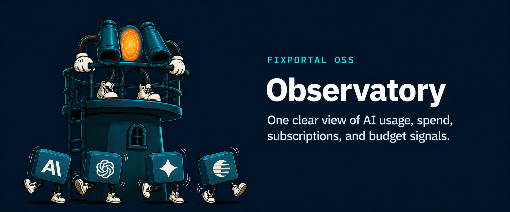
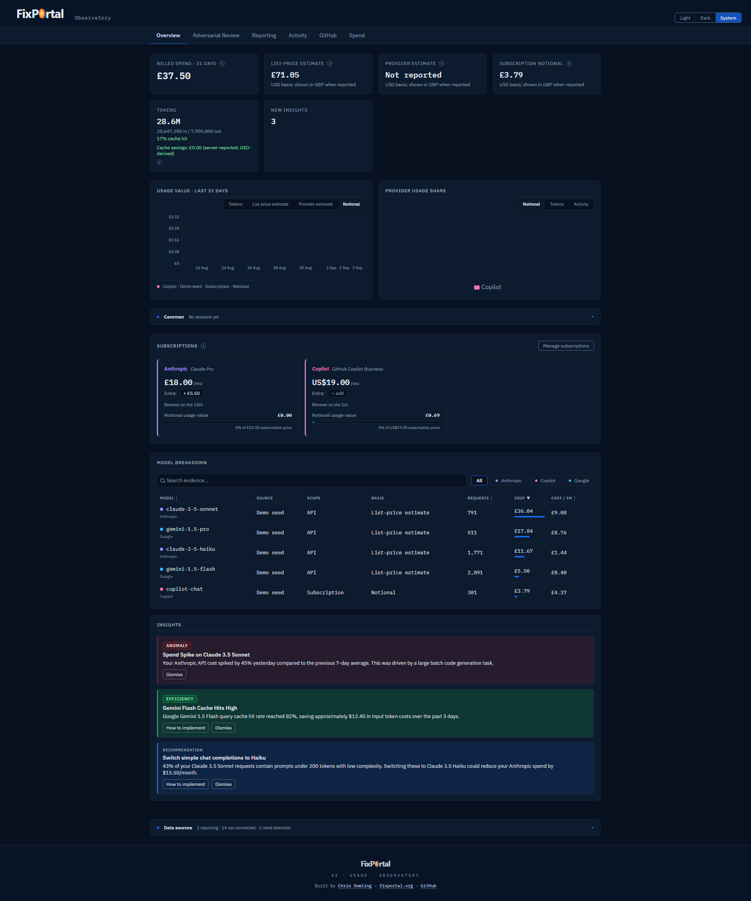

# Observatory




> OSS observability for AI usage and cost evidence, as of 2026-08-25. It keeps billed spend, public-list estimates, subscription notional values, and missing data distinct.

Observatory is a .NET 10 and React 19 dashboard with a PostgreSQL store. Provider sources, local CLI telemetry, and manual entries retain provenance so unlike evidence is never silently merged.

## Read these first

- [Provider setup](docs/provider-setup.md) — every source, access requirement, and known unavailable capability.
- [Truth and pricing](docs/truth-and-pricing.md) — source/scope/basis meanings and safe catalog refresh.
- [Adding a provider](docs/adding-a-provider.md) — the compile-time adapter seam.
- [Local producers](clients/README.md) — Codex, Copilot, Claude, Kimi, Gemini review, and Antigravity sweeper setup.
- [Postman collection](docs/observatory.postman_collection.json) — representative authenticated API requests.
- [OSS qualification](docs/oss-qualification.md) — validation evidence and remaining limitations.

Release `v1.0.1` starts a fresh public Git history; earlier history is archived by the
maintainer. If you have an older checkout, preserve local work and clone again.

## Local development

### Quick start

Restore uses public feeds; no GitHub Packages token is required.

```powershell
docker compose up --build
```

This starts PostgreSQL, the API, provider/pricing ingest, and the frontend at [http://localhost:4173](http://localhost:4173). The compose seed populates synthetic sample data; it is labelled `demo-seed` and is not a representation of provider billing. Optional GitHub billing uses `GITHUB_TOKEN` plus `GITHUB_BILLING_ORG`; the token needs the broader access listed in [provider setup](docs/provider-setup.md#compatibility-github-and-manual-sources).

For a manual run, install .NET SDK 10, Node `^22.22.2`, `^24.15.0`, or `>=26.0.0`, and PostgreSQL 16. The sweeper client needs Node 24 or later; see [Local producers](clients/README.md). The commands below reuse the Compose database and its local development credentials:

```powershell
docker compose up -d --wait db
```

```powershell
$env:DB_CONNECTION = 'Host=localhost;Port=5433;Database=aiobservatory;Username=aiobs;Password=aiobs'
```

```powershell
$env:OBSERVATORY_API_KEY = 'change-me'
```

```powershell
dotnet restore AiObservatory.slnx
```

```powershell
npm --prefix src/AiObservatory.Web ci
```

```powershell
dotnet run --project src/AiObservatory.Api
```

The API applies pending EF Core migrations when it starts. In a separate shell, give the frontend the same local development key, then start it:

```powershell
$env:VITE_API_KEY = 'change-me'
```

```powershell
npm --prefix src/AiObservatory.Web run dev
```

For a manual run, start the ingest worker in another shell; it only activates sources whose required settings are present:

```powershell
$env:DB_CONNECTION = 'Host=localhost;Port=5433;Database=aiobservatory;Username=aiobs;Password=aiobs'
```

```powershell
dotnet run --project src/AiObservatory.Ingest
```

### Optional settings

| Setting | Effect when unset |
| --- | --- |
| `Activity__ProjectOwners` | The Activity and GitHub tabs show every project and repository that was ingested. Set it to a comma-separated list of GitHub account names to narrow them to those owners. |
| `VITE_ATTRIBUTION_NAME`, `VITE_ATTRIBUTION_URL` | The footer shows only a link to this project. Set both to credit whoever runs your instance. |
| `BUDGET_ALERT_MESSAGE_ID_DOMAIN` | Budget alert `Message-Id` headers use the domain of your configured sender address, or `observatory.local` if no sender is configured. |

Use neutral placeholders such as `<observatory-api-key>` outside your secret store. See [Provider setup](docs/provider-setup.md) for acquisition settings; public pricing catalogs require no credentials. Google Cloud SKU pricing remains unavailable until verified mappings exist, independently of the bundled Gemini Developer API rates.

## Dashboard truth



The Overview above runs on the Compose demo seed. Note that provider estimate reads `Not reported` rather than zero, because the seed carries no provider-reported cost — the distinction the cards exist to preserve:

- Billed spend contains provider-reported financial or ledger evidence only.
- Estimated cost is API usage rated from an observed public catalog.
- Subscription notional value is a separate comparison, not spend.
- Missing money or tokens read `Not reported`, never zero.
- Source status shows configuration, freshness, failure, and unavailability separately from process liveness.

Supported acquisition includes OpenAI usage/costs, Anthropic usage/cost reports and optional Claude Code analytics, GitHub Copilot organization engagement, Google Cloud Billing BigQuery export, GitHub activity/billing, and six local transcript collectors. The [provider matrix](docs/provider-setup.md) is the authoritative capability list.

## API

Requests use `X-Observatory-Key` when API keys are configured. The most useful entry points are:

| Method | Route | What it provides |
| --- | --- | --- |
| `GET` | `/api/aggregates` | Daily source-aware usage and cost aggregates |
| `GET` | `/api/sources/status` | Source configuration, freshness, and sanitized status |
| `POST` | `/api/events` | A provenance-labelled usage event |
| `GET` | `/api/subscriptions` | Subscription ledger records |
| `GET` | `/api/insights` | Generated insights |

Import the [Postman collection](docs/observatory.postman_collection.json), set `base_url` and `api_key`, and use its source-aware event examples. It is a representative collection, not an exhaustive API specification.

## Bringing your own data

Observatory accepts private evidence through three supported paths, none of which requires publishing anything to this repository:

- **Usage events.** `POST /api/events` accepts a provenance-labelled snapshot (`sourceId`, `sourceKind`, `usageScope`, `costBasis`); the [Postman collection](docs/observatory.postman_collection.json) carries source-aware examples. Events are source-scoped, so re-posting a corrected snapshot replaces its previous contribution.
- **Spend entries.** The Spend page records manual ledger entries under the `manual-ledger` source; they behave like provider-billed rows in every total and reconciliation.
- **A private adapter.** For recurring feeds — a custom expense source, an internal billing export — [adding a provider](docs/adding-a-provider.md) describes the compile-time adapter seam. An adapter can live in your own fork or deployment; it never needs to be upstreamed.

## Contributing

Run the focused local-producer check:

```powershell
node --test clients/observatory-sweep.test.mjs
```

Run the solution checks before a pull request:

```powershell
dotnet test --solution AiObservatory.slnx --configuration Release
```

Run the opt-in PostgreSQL repricing qualification workload separately; it reports the median of three 1,000-event pricing activations and does not enforce a machine-specific timing threshold:

```powershell
dotnet run --project tests/AiObservatory.Data.Tests/AiObservatory.Data.Tests.csproj --configuration Release -- --explicit only --filter-method AiObservatory.Data.Tests.Pricing.PricingRepricingServiceTests.QualificationRepricesEveryEligibleEventAndItsAggregate --show-live-output on --output Detailed
```

```powershell
npm --prefix src/AiObservatory.Web test -- --run
```

The repository is [Apache-2.0](LICENSE) licensed. Keep provider changes source-aware and update the setup matrix with any new capability or limitation.

- [Contributing](CONTRIBUTING.md)
- [Code of Conduct](CODE_OF_CONDUCT.md)
- [Security policy](SECURITY.md)

## Troubleshooting

| Symptom | Cause and next step |
| --- | --- |
| A provider is `Not configured` | Supply the exact required settings and upstream access in [Provider setup](docs/provider-setup.md). |
| Google Cloud catalog stays unavailable | Cloud SKU mappings remain unavailable; Gemini Developer API list pricing and billed BigQuery export are independent. |
| Claude activity appears twice | Exclude local Claude telemetry when Claude Code Analytics covers the same activity. |
| A cost is missing | Required model dimensions may be unknown; Observatory intentionally returns no guessed fallback price. |
