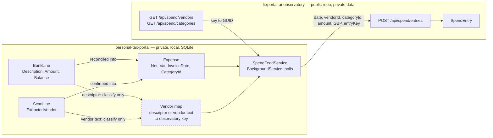

# Tax-portal billed-spend feed — design

> How real billed spend reaches the observatory's spend ledger from
> `personal-tax-portal`. Companion to
> [`2026-07-26-billed-spend-ledger-design.md`](2026-07-26-billed-spend-ledger-design.md),
> which built the ledger and named this feed as one of its three entry paths
> (§6, §*Out of scope*). Amounts throughout are **GBP**; the portal holds no
> other currency at rest. Code references verified against
> `personal-tax-portal` @ `2f6a39d` and this repo @ `5c43e76`.

## Executive summary

The ledger already accepts this feed — `SpendSource.Portal` exists, the array
POST was designed for three callers, and `EntryKey` gives idempotency. **No
observatory change is needed to receive spend.** The work is a
`BackgroundService` in the tax portal.

Two things blocked a *correct* feed. **The first is now resolved and built**
(§3); the second is still open:

1. ~~**Refunds cannot be represented.**~~ **Resolved 2026-07-27, and fully closed
   2026-07-29.** A refund is now a negative `Amount`; the non-negative check
   constraints are gone and only zero is rejected. Feeding only debits would have
   overstated billed spend by the refund total (£492.80 across the three known
   credits) — the same class of silent overstatement this project exists to correct,
   arriving from the other direction.

   **The portal side is done too, and differently from what this document assumed.**
   It said the portal had no refund concept, so the feed would have to select refunds
   out of `Income` (phase 3). The portal instead books a refund as a **negative
   `Expense`** (`personal-tax-portal` PR #68): a supplier credit reverses a purchase,
   so booking it as income would inflate Box 6 *and* leave the original purchase
   overstated — wrong in two places at once. Every calculator there already summed
   signed values, so none changed. **Consequence for this feed: refunds arrive through
   the ordinary `Expense` path with a negative amount, and phase 3's `Income` selection
   is not needed at all.**
2. **The portal has no vendor column.** `Expense` does not store a merchant.
   Vendor text exists only on `ScanLine.ExtractedVendor`, and only for expenses
   confirmed from an OCR'd invoice; a card charge reconciled straight off a bank
   line has nothing but `BankLine.Description` — the raw statement descriptor,
   which is exactly what the privacy boundary forbids transmitting.

A third decision — whether the ledger receives `Net` or `Gross` — changes every
variance figure by up to 20% and is easy to get silently wrong.

This document also **corrects one parked decision**: the feed should key on the
portal's own primary key, not `SpendEntryKey.Derive`. See §6.

## 1. What changed since the ledger design

The ledger design assumed a portal that could name a vendor and hand over a
finished spend line. Reconnaissance says otherwise. Assumptions worth retiring
before anything is built:

| Assumption | Reality | Consequence |
|---|---|---|
| Portal knows the vendor | No vendor column on `Expense`; text lives on `ScanLine.ExtractedVendor` only when an invoice was scanned | Classification must be a portal-side mapping, §5 |
| Portal rows are already "AI spend" | Portal holds **all** business expenses | Feed needs an explicit allowlist, §5 |
| Use `SpendEntryKey.Derive` for the key | Portal has a stable `Expense.Id`; a content hash is strictly worse | Key on the primary key, §6 |
| Refunds are a ledger-side gap | Portal has no refund concept either — a credit becomes `Income` | Both sides need a decision, §3 |
| Currency needs FX | Portal is GBP-only at rest, no `Currency` column anywhere | Every row posts `GBP`, rate short-circuits to `1`, §7 |
| One amount, obviously | `Net` + `Vat`, `Gross` computed; VAT may be reclaimed | Amount basis is a real decision, §4 |

## 2. Architecture

Flow, and where the privacy boundary sits. Dashed edges carry data that is used
for classification and **never leaves the portal**:



**The classification stays private.** This is the load-bearing property: the
portal resolves a raw descriptor to an observatory vendor key locally and posts
only the resolved key. The descriptor, the balance and the account never cross.
That is what lets billed spend live in a public repo at all.

**Push, not pull.** The observatory never reaches into the portal — same
direction of flow as `observe-sweep.ps1` for tokens, and the portal is a local
SQLite app with no public ingress.

### Where the code goes

Everything in this section is `personal-tax-portal`. The portal has three
`BackgroundService` hosted services already (`InboxWatcherService`,
`LibraryWatcherService`, `OcrProcessorService`) and one `IHttpClientFactory`
named-client registration (`"ollama"`, in `Program.cs`). Follow both patterns:

| Piece | Path | Shape |
|---|---|---|
| Feed worker | `src/TaxPortal.Api/Services/SpendFeedService.cs` | `BackgroundService`, poll loop with `Task.Delay` |
| Options | `src/TaxPortal.Api/Options/ObservatoryOptions.cs` | Bound from `Observatory` config section |
| Vendor map | `src/TaxPortal.Api/Options/ObservatoryOptions.cs` | Part of the same options object, §5 |
| HTTP client | `src/TaxPortal.Api/Program.cs` | `AddHttpClient("observatory")`, bounded timeout |

> [!IMPORTANT]
> The observatory's `POST` is a write, so it needs the **admin** key
> (`ApiKeyEndpointFilter.AuthorizeAdminAsync` — only GET accepts the read-only
> key). That key grants full write access to the observatory, including
> `DELETE /api/aggregates`. It must not be committed. The portal has no Key
> Vault or user-secrets usage today; supply it as an environment variable
> through the existing docker compose, not `appsettings.json`.

## 3. Decision 1 — refunds — RESOLVED, observatory side shipped

> [!NOTE]
> **Ruled 2026-07-27: Option A, signed amounts.** The observatory half is built —
> migration `20260727090653_AllowNegativeSpendAmounts` replaces
> `CK_SpendEntry_Amount_NonNegative` and `CK_SpendEntry_AmountGbp_NonNegative`
> with `CK_SpendEntry_Amount_NonZero`, the API accepts a negative `amount` and
> now rejects only zero, and the manual entry form gained a Charge/Refund toggle
> (a typed negative is still refused, so the toggle is the only way to book one).
> The portal half — selecting refunds out of `Income` — remains phase 3.
> The reasoning below is kept as the record of why.

Feeding `Expense` alone overstates billed spend by the refund total,
permanently and silently.

State at the time of the ruling:

| Side | How a refund is represented | Can the feed carry it? |
|---|---|---|
| `personal-tax-portal` | An `Income` row. `Expense.Net`/`Vat` are rejected below zero by `ReconciliationEndpoints`; direction is fixed by `BankLine.Amount`'s sign | Still no — refunds are not in the `Expense` table at all (phase 3) |
| Observatory ledger | **Now a negative `Amount`.** Was: not at all, blocked by `CK_SpendEntry_Amount_NonNegative` **and** `CK_SpendEntry_AmountGbp_NonNegative` | Yes, since `AllowNegativeSpendAmounts` |

Two candidate fixes, both requiring an observatory migration:

**Option A — signed amounts.** Drop both check constraints; a refund is a
negative `Amount`, and `AmountGbp` follows.

**Option B — an explicit refund flag.** `SpendEntry` gains
`IsRefund` (or a `SpendEntryKind` enum); `Amount` stays non-negative and every
aggregate subtracts when the flag is set.

**Chosen: Option A.** The deciding argument is the failure mode, not the
modelling purity. `AmountGbp` is the only column ever summed — a design
invariant of phase 1. Under Option A every existing sum (totals, breakdowns,
time series, the future variance region) is correct with **zero** call-site
changes. Under Option B every one of those call sites must remember
`CASE WHEN "IsRefund" THEN -"AmountGbp" ELSE "AmountGbp" END`, and any that
forgets silently overstates — reintroducing exactly the bug class the project
was built to eliminate. Option B's advantage, that the constraint keeps doing
its job, is recoverable at the UI layer: the manual entry form can still reject
a negative unless an explicit "this is a refund" toggle is set, and the DB can
keep a weaker `Amount <> 0` constraint.

Option A's honest cost: a typo'd negative in the manual form becomes possible at
the DB level. That is a visible, single-row, correctable error. A forgotten flag
in an aggregate is an invisible, permanent, systemic one.

The earlier "load debits only and flag the gap" call applied to the one-off CSV
load and was explicitly not a decision about the permanent fix. This was.

> [!NOTE]
> **Portal side — SUPERSEDED 2026-07-29.** This section used to say the feed must
> select refunds from `Income` rather than `Expense`, and warned at length that the
> rule was not groundable because an `Income` row carries nothing marking it as
> "money back from a supplier" — risking client revenue being booked as negative AI
> spend.
>
> **None of that applies any more.** The portal now books a refund as a **negative
> `Expense`** (PR #68), for its own accounting reasons: a supplier credit reverses a
> purchase, so treating it as income would inflate Box 6 and leave the original
> purchase overstated. Refunds therefore arrive through the ordinary `Expense` path,
> already carrying the same category as the charge they reverse — the portal's own
> backfill enforced that, because otherwise its family subtotals stop netting.
>
> The danger this warning guarded against is gone with it: client revenue lives in
> `Income`, which this feed does not read at all.
>
> One thing to carry into phase 2 instead: a negative `Expense` must not be filtered
> out by an amount guard. The ledger accepts any non-zero amount
> (`CK_SpendEntry_Amount_NonZero`), so the feed must not add a stricter rule of its
> own.

## 4. Decision 2 — Net, Gross, or Net-when-reclaimed — RESOLVED

> [!NOTE]
> **Ruled 2026-07-27: `VatClaimed ? Net : Gross`.** Portal-side rule, so nothing to
> build here yet; recorded so phase 2 does not have to re-derive it. `VatClaimed` is
> a real per-expense human-set flag (filterable in the portal's own transactions UI),
> not a derived or defaulted value, so the rule is well-founded rather than a proxy.


`Expense` stores `Net` and `Vat`; `Gross` is computed and not persisted. The
ledger takes one `Amount`.

| Basis | What it means | Effect on estimate-vs-billed |
|---|---|---|
| `Gross` | What actually left the bank | Inflates variance ~20% against a VAT-exclusive USD estimate |
| `Net` | Ex-VAT charge | Matches the estimate's basis; understates cash out when VAT is not reclaimable |
| `VatClaimed ? Net : Gross` | Cost actually borne | Correct on both counts |

**Recommendation: `VatClaimed ? Net : Gross`.** Reclaimed VAT is not a cost, and
the token-cost estimate it will be compared against is VAT-exclusive US pricing.
Posting `Gross` for a reclaimed-VAT charge would show a permanent ~20% variance
that is an artefact of the basis mismatch, not of anything real — and region 5
of the ledger UI exists specifically to make variance meaningful.

Record the basis in the row's `Description` (e.g. `"Anthropic credits (ex-VAT)"`)
so a reader can tell which rule applied without re-deriving it.

## 5. Decision 3 — vendor identification and the allowlist

**Blocking, and the largest piece of actual work.**

`Expense` has no merchant. The available signals, in order of quality:

| Signal | Available when | Quality |
|---|---|---|
| `ScanLine.ExtractedVendor` via `Expense.ScanLineId` | Expense confirmed from an OCR'd invoice | Good — a real vendor name |
| `BankLine.Description` via `BankLine.MatchedExpenseId` | Expense reconciled to a bank line | Raw statement descriptor; noisy but present |
| Nothing | Manually created, never scanned or reconciled | Unclassifiable — skip |

The portal already has normalisation worth reusing rather than rewriting:
`CategorySuggester.NormaliseVendor` strips OCR's parenthesised FX annotation and
folds to alphanumeric-uppercase, so `"Amazon.co.uk"` and `"AMAZON CO UK"` match.

> [!NOTE]
> **UNBLOCKED 2026-07-29 — the portal categories map cleanly, and the problem
> disappeared.** This block previously read "blocked on portal data cleanup", on the
> reasoning that if the new portal categories mapped onto the observatory's the problem
> would vanish, and if they did not the portal would need a separate AI tag. They map,
> 1:1. See §5a below for the resolved design. The vendor half was never blocked and was
> actioned at the time.
>
> The parked "feed from the portal, not a one-off bulk load" decision therefore stands
> as originally taken: the portal *can* express the category axis, per charge.

### What the real data showed

The bank export (`all_ai_spend.csv`, 41 rows, outside the repo) settles the vendor
axis regardless of the portal, and corrects an error in this document's own first
draft. Merchants there are already clean single tokens, and Chris's existing labels
carry the category:

| Vendor | Groupings present in the data | Net |
|---|---|---:|
| Anthropic | bare, Extra-Usage, Subscription | −£2,158.07 |
| Microsoft | Azure, bare | −£716.71 |
| Moonshot | Subscription, **Refund** | −£731.03 |
| CodeRabbit | Code-Review + Subscription, Extra-Usage | −£795.76 |
| Google | Subscription, Extra-Usage, Cloud Storage, **Refund** | −£333.33 |
| OpenAI | Subscription, Extra-Usage | −£230.08 |
| Gitar | Code-Review + Subscription | −£186.49 |
| Github | CI | −£89.21 |
| Blacksmith | CI | −£9.78 |
| OpenRouter | bare | −£8.27 |

Credits reconcile exactly to the £492.80 recorded when this was parked
(Moonshot £286.16, Google £129.31, Google £77.33).

**This invalidates the one-category-per-vendor shape proposed below.** Anthropic
spans three groupings and Google four, which is precisely the "vendors span
categories" property the ledger design is built around. Whatever replaces the
portal's categories must preserve a per-*charge* category, not a per-vendor one.

### Google "Cloud Storage" — include, category `cloud`

Ruled 2026-07-27. Two rows, net −£112.66, labelled `AI,Budgeted,Business,Cloud
Storage,Subscription`.

This reverses the earlier lean toward excluding it, on consistency grounds: the
already-taken decision puts £638.36 of Microsoft **Azure** spend in the ledger under
a Cloud category, and Google Cloud Storage is the same shape — cloud infrastructure
supporting AI work, with no token estimate behind it. Excluding one while including
the other would make the Cloud total arbitrary. Both are tagged AI by the same hand
under the same rules.

The `cloud` category is what keeps this honest: it holds spend that is real but has
no estimate to compare against, and the estimate-vs-billed region already excludes
vendors with no token link, so it cannot distort variance.

### Actioned: the vendor axis

Five vendors carrying real spend had no row to record it against. Seeded by
`20260727093336_SeedRemainingSpendVendorsAndCloudCategory`, together with a **Cloud**
category (sort 50) for infrastructure spend, which has no token estimate behind it
and would distort Subscription if folded in:

| Slug | Provider link | Default category | Why |
|---|---|---|---|
| `openai` | `OpenAI` | Subscription | Metered tokens; omitted from the original seed |
| `google` | `Google` | Subscription | Metered tokens |
| `microsoft` | none | Cloud | Azure infrastructure, no token estimate |
| `openrouter` | none | Subscription | No `Provider` enum member |
| `blacksmith` | none | CI | No `Provider` enum member |

**Design: an explicit, config-held allowlist keyed on observatory slugs.**

The **vendor** half is settled and complete — every vendor with observed spend has
a mapping, so nothing is silently skipped:

```jsonc
// appsettings.json — "Observatory" section. Keys are observatory slugs, not GUIDs.
"VendorMap": [
  { "match": ["ANTHROPIC", "CLAUDEAI"], "vendor": "anthropic"  },
  { "match": ["CODERABBIT"],            "vendor": "coderabbit" },
  { "match": ["GITAR"],                 "vendor": "gitar"      },
  { "match": ["MOONSHOT"],              "vendor": "moonshot"   },
  { "match": ["OPENAI"],                "vendor": "openai"     },
  { "match": ["GOOGLE"],                "vendor": "google"     },
  { "match": ["MICROSOFT", "AZURE"],    "vendor": "microsoft"  },
  { "match": ["OPENROUTER"],            "vendor": "openrouter" },
  { "match": ["BLACKSMITH"],            "vendor": "blacksmith" }
]
```

`github-actions` and `copilot` are deliberately absent: a single `GITHUB`
descriptor cannot tell them apart, and §5's billing evidence shows the three
observed GitHub charges are not the Actions bill at all. They need a rule that
does not exist yet, so their spend is skipped and logged rather than guessed —
the same treatment as any unmatched expense, and visible for exactly that reason.

> [!IMPORTANT]
> **There is deliberately no `category` key above, and there never will be.** An
> earlier draft carried one category per vendor; the real data kills that — Anthropic
> spans three groupings and Google four, so a fixed per-vendor category would file
> every Anthropic charge as `credits` and destroy the per-charge category the ledger
> design is built on. The category comes from the charge, via §5a. The vendor's
> `DefaultCategoryId` is a fallback for the unclassifiable remainder, not the
> mechanism.

Matching runs against the normalised form of whichever signal is available,
preferring `ExtractedVendor`. **An unmatched expense is skipped, never guessed**
— the ledger design's failure-mode table already rules that auto-creating
vendors is how `CI` and `CI/CD` become two categories, and a false positive here
puts a non-AI business expense into the AI ledger.

**Slugs, not GUIDs, in config.** The feed resolves slug → GUID at run time via
`GET /api/spend/vendors?includeArchived=true` and the matching categories call.
Seeded vendors have fixed GUIDs (appendix), but anything created through the
catalog panel gets a random one, so hardcoding GUIDs would break the moment a
vendor is added in the UI. Resolving by slug is self-healing; an unresolvable
slug is a startup-visible configuration error, not a silent skip.

> [!WARNING]
> Vendors are the one axis where a mapping mistake is invisible in the result. A
> wrong category shows up as a strange breakdown; a wrong vendor silently
> attributes one company's spend to another and corrupts variance. Every map
> entry should be added deliberately, and the feed should log every skipped
> unmatched expense at `Information` so the map's gaps are observable.

## 5a. Decision 3b — the category axis — RESOLVED 2026-07-29

The portal's category cleanup landed (`personal-tax-portal` PR #73, merged `46c52a4`).
`Category` gained a nullable self-referencing `ParentId`: exactly two levels, and only
leaf categories are bookable, enforced on every write path. An `AI` family was seeded
with five children, and 22 existing expenses were re-pointed into it against the actual
invoices.

**The five children map 1:1 onto this ledger's category slugs. No translation table.**

| Portal category | Observatory slug | Category GUID |
|---|---|---|
| `AI - Subscription` | `subscription` | `11111111-1111-1111-1111-111111111104` |
| `AI - Extra Usage (Credits)` | `credits` | `11111111-1111-1111-1111-111111111102` |
| `AI - Code Review` | `code-review` | `11111111-1111-1111-1111-111111111101` |
| `AI - CI/CD` | `ci` | `11111111-1111-1111-1111-111111111103` |
| `AI - Cloud` | `cloud` | `11111111-1111-1111-1111-111111111105` |

### This is better than the design anticipated: the allowlist moves off the vendor

§5 assumed the vendor map would have to answer two questions — *is this AI spend?* and
*what kind?* — because the portal held "all business expenses" with no way to tell. It
now answers both itself, from the category:

- **In scope** = the expense's category has parent `AI`. Nothing else is AI spend.
- **Which category** = the child's own name, through the table above.

So the vendor map in §5 is no longer the scope mechanism. It stays, but its only
remaining job is **vendor attribution**, because `Expense` still has no vendor column
(§1). An AI-family expense whose vendor cannot be resolved is a vendor problem, not a
scope problem — and the §9 privacy boundary is unaffected, since the resolution still
happens portal-side and only the resolved key is posted.

**Why this is trustworthy in a way a vendor heuristic was not:** every one of those
categories was set by a human confirming a charge, against the invoice. The backfill
that seeded them refused to guess wherever a vendor spanned children, and it was right
to — the decisive case was two Anthropic charges of **exactly £150**, one week apart,
where the invoices read `Prepaid extra usage` and `Max plan - 20x`. Any amount- or
vendor-based rule books both the same way and is wrong about one of them.

### Consequences for the phases

- **Phase 2 is unblocked.** Its remaining work is unchanged: options, the vendor map,
  slug resolution, the poll loop and the additive POST.
- **The `github-actions` / `copilot` gap in §5 is closed by the same mechanism.** A
  single `GITHUB` descriptor still cannot distinguish them, but it no longer has to —
  a GitHub charge carries `AI - Subscription` or `AI - CI/CD` on the expense itself.
  Vendor attribution for GitHub remains: use `github` for org-billed spend, `copilot`
  for the personal account. (`DestructiveDude` is the former name of `chris-fixportal`;
  the personal-Copilot reading is now confirmed from receipts, not inferred from
  billing shape, which closes that open question in §5.)
- **Refunds (phase 3) inherit their parent charge's category** — settled portal-side by
  the same backfill, and required for the family subtotal to net correctly.

> [!NOTE]
> One thing the portal deliberately does not send: it computes a rendering flag for the
> flat-category case but excludes it from its own JSON, and this feed has no equivalent
> need. The category name is the only thing that crosses.

### The GitHub charges — the premise was wrong

Three GitHub charges (£42.98 on 2026-06-22, £8.95 on 2026-06-03, £37.28 on
2026-05-28, £89.21 total) were parked awaiting a split between GitHub Actions and
Copilot. The GitHub billing API settles it, and not the way the question assumed.

`GET /organizations/FixPortal/settings/billing/usage?year=2026` returns, net USD
(as at 2026-07-27; July was still an open month and has grown since the first pull):

| Month | `actions` | `ghas` | `code_quality` | `packages` | Total |
|---|---:|---:|---:|---:|---:|
| 2026-05 | 9.40 | 0.97 | — | — | **10.37** |
| 2026-06 | 108.49 | 30.00 | — | 0.00 | **138.49** |
| 2026-07 | 133.60 | 26.13 | 14.59 | 0.00 | **174.33** |

`?year=2025` returns an empty list, so May 2026 is the whole history — nothing
earlier is missing.

Three findings, all material:

1. **There is no `copilot` product line in the org bill at all** — yet the ingest
   worker recorded Copilot token usage continuously from 2026-05-26 to 2026-07-10.
   Copilot is therefore billed somewhere other than the org account.
2. **The org holds zero Copilot seats.** `GET /orgs/FixPortal/copilot/billing`
   reports `seat_breakdown.total: 0` with `seat_management_setting: unconfigured`.
   So the absence in (1) is not a reporting quirk — the org genuinely buys no
   Copilot, and no org-billed reading of the three charges can be correct.
3. **The org's own bill ($323.19 across May–July) does not appear in the CSV at
   all.** The export carries a single account (YJC Solutions, 41 rows,
   2025-12-10 to 2026-07-26) and contains no July GitHub charge whatsoever despite
   $174 of July usage. So the three charges are not the Actions bill, and the CSV
   is an *incomplete* picture of GitHub spend — a far bigger gap than the £89.21
   these rows represent.

Reading: the three charges are a recurring, mid-month, subscription-shaped payment
in a period with heavy Copilot use and no Copilot line on the org invoice — most
consistent with a personally-billed Copilot subscription, **not** Actions. Booking
them to `github-actions` (the obvious default) would have been wrong in both vendor
and category.

**Actioned:** a `copilot` vendor now exists
(`20260727095120_SeedCopilotVendor`), carrying `Provider.Copilot` and defaulting to
Subscription. That is justified independently of these three rows: Copilot was the
only metered provider whose estimate could never be compared against a billed
figure, because there was no vendor to record one against.

**Actioned (2):** both follow-ups this raised are now closed by a billing sync in
the API — `GitHubBillingSyncService`, wired into the daily background cycle.

Rather than try to reconcile GitHub through a bank export that demonstrably does
not contain the bill, the ledger now reads GitHub's own billing API directly. That
is the authoritative source: it is itemised, per-product, per-month, in USD, and it
needs no reconciliation step at all. It closes both gaps at once —

- the org's $323.19 (and everything after it) now reaches the ledger, and
- `code_quality` gets a home: a new `github` vendor
  (`20260727164846_SeedGitHubVendor`), booked to **Code Review**, because Code
  Quality AI Credits are metered AI review spend of exactly the same kind as
  CodeRabbit.

Entries are keyed `github:{yyyy-MM}:{product}:{sku}` and **upserted**, deliberately
excluding the amount from the key — an open month accrues daily, so keying on
identity lets a re-run update the figure rather than duplicate it or wait for month
end. See the README's *GitHub billing sync* section for the full product map.

> [!IMPORTANT]
> One follow-up remains open: the three £89.21 charges are still unattributed.
> The org-Copilot readings above rule out an org-billed explanation, which leaves a
> personally-billed subscription on `chris-fixportal` as the best fit — but that is
> still inference from billing shape, not an invoice line. The personal billing
> endpoint needs a `user` scope the current token lacks
> (`gh auth refresh -h github.com -s user`). Confirm against the actual GitHub
> invoices before treating the Copilot reading as settled.
>
> Note this is a *classification* question, not a coverage one: those three rows
> are in the CSV either way. The coverage gap — the part that made GitHub spend
> materially understated — is closed.

## 6. Idempotency — correcting a parked decision

The parked plan was `source: portal` with an `EntryKey` from
`SpendEntryKey.Derive`, noting it would be that function's first real caller.

**That is the wrong key for this feed.** `SpendEntryKey.Derive` hashes
`occurredOn + vendor + amount + currency + description + occurrence` because a
CSV row has no stable identity. An `Expense` does: `Expense.Id`, a SQLite
primary key.

| Scenario | Content hash | `Expense.Id` |
|---|---|---|
| Re-send unchanged | `duplicate`, correct | `duplicate`, correct |
| Amount corrected in portal, re-sent | Hash changes → **second row lands, original stays. Silent double-count** | `duplicate`, original preserved — recoverable |
| Two identical charges, same day | Needs an occurrence index to survive | Distinct ids, no special case |

The double-count row is decisive: correcting a figure in the portal must never
inflate the ledger. Use:

```
entryKey = "expense:{Expense.Id}"      // refunds: "income:{Income.Id}"
```

The unique index is `(Source, EntryKey)` filtered to `EntryKey IS NOT NULL`, so
`portal`-sourced keys cannot collide with CSV or manual rows.
`SpendEntryKey.Derive` remains correct for CSV import and stays as-is.

**Edits still need a second step.** A `duplicate` verdict returns the existing
row's `Id` (`SaveRowAsync` looks it up specifically so it can). A later phase can
`PATCH /api/spend/entries/{id}` when the portal's figure has moved. Phase 1 is
additive only; a corrected amount will not propagate, which is an accepted and
visible limit rather than a silent one.

## 7. Wire contract

The feed posts the array the ledger already accepts. No new endpoint.

```jsonc
POST /api/spend/entries
X-Observatory-Key: <admin key>
Content-Type: application/json

[
  {
    "occurredOn":  "2026-06-22",        // Expense.InvoiceDate, ISO yyyy-MM-dd
    "vendorId":    "22222222-2222-2222-2222-222222222201",
    "categoryId":  "11111111-1111-1111-1111-111111111102",
    "amount":      120.00,               // per §4
    "currency":    "GBP",                // always; portal holds no other currency
    "description": "Anthropic credits (ex-VAT)",
    "source":      "portal",
    "entryKey":    "expense:4812"
  }
]
```

Response is a per-row verdict array, `200 OK` even when rows are rejected:

```jsonc
[ { "id": "…", "status": "created",   "reason": null },
  { "id": "…", "status": "duplicate", "reason": null },
  { "id": null, "status": "rejected", "reason": "Unknown VendorId: …" } ]
```

Constraints the feed must respect, all already enforced server-side:

| Constraint | Value | Source |
|---:|---|---|
| Max rows per request | 1000 | `SpendEntriesEndpoints.MaxBatch` |
| `description` max length | 200 | `Validate` |
| `entryKey` max length | 200 | `Validate` |
| `currency` | 3 upper-case ASCII letters | `Validate` |
| `amount` | non-zero; negative is a refund | `Validate` + `CK_SpendEntry_Amount_NonZero` |

**FX is a no-op here.** `FxRateProvider.GetGbpRateOnAsync` short-circuits `GBP`
to rate `1` before any HTTP call, so the feed never touches Frankfurter and the
`FxUnavailableException` rejection path is unreachable for portal rows.

> [!CAUTION]
> The portal's `HmrcMonthlyFxRateProvider` currently ships with **zero seeded
> rates**, so an OCR'd foreign-currency invoice can leave an unconverted amount
> in `Net` with a `ScanLine.ReviewFlag` set. Confirmation is human, so a
> reviewed row should be GBP — but the feed should skip any expense whose
> originating scan line still carries an unresolved review flag rather than post
> a foreign amount labelled `GBP`. That mislabel would be frozen into
> `AmountGbp` permanently.

## 8. Scheduling and failure modes

**A rolling re-send window, not a watermark.** Because `entryKey` makes the POST
idempotent, the worker can re-send the last N days every run and let `duplicate`
verdicts absorb the overlap. No exactly-once bookkeeping, no watermark table to
drift, and a missed run self-heals on the next one. Suggested window 90 days,
batched to the 1000-row cap — well inside it at realistic volume.

| Failure | Behaviour |
|---|---|
| Observatory unreachable / 5xx | Log, do nothing else. Next poll re-sends the same window. |
| `401` | Log an error naming the config key. Do not retry in a tight loop — a wrong key will not fix itself. |
| Row `rejected` | Log at `Warning` with the reason and the `Expense.Id`. Never fail the batch. |
| Row `duplicate` | Expected on every run after the first. Log at `Debug` only, or the log becomes noise. |
| Expense unmatched by the vendor map | Skip, log at `Information`. This is the map's to-do list. |
| Expense deleted in the portal | Ledger row lingers. Known limit — see below. |
| Two runs overlap | Harmless; `(Source, EntryKey)` is a unique index, the loser gets `duplicate`. |

**Known limit — deletions.** An expense deleted or re-categorised in the portal
leaves a stale ledger row, because the feed is additive. The fix is a reconcile
pass that lists `source: portal` entries in the window and `DELETE`s any whose
`entryKey` no longer resolves to a live portal row. Deferred, not designed away:
it needs `GET /api/spend/entries` to return `entryKey`, which it does (the
endpoint returns whole `SpendEntry` rows).

## 9. Privacy boundary — what must never leave

The observatory repo is public. The rule from the ledger design §3 is **linkage,
not amounts**. `SpendEntry`'s shape blocks most of this structurally and
`ArchitectureTests.SpendEntry_must_not_carry_bank_linkage` enforces it — but
`Description` is free text and is the one smuggling route.

Every field below exists in the portal and must **never** appear in a posted
row, including inside `description`:

| Field | Where it lives | Why it is dangerous |
|---|---|---|
| `AccountNumber`, `SortCode` | `BankStatement` | Direct bank linkage |
| `StatementNumber` | `BankStatement` | Identifies the statement document |
| `OpeningBalance`, `ClosingBalance`, `TotalMoneyIn/Out` | `BankStatement` | Running financial position |
| `Balance` | `BankLine` | Running balance per line |
| `Description` | `BankLine` | **Raw statement descriptor** — merchant references, card fragments, FX annotations |
| `FileName`, `StoredPath`, `ContentHash` | `BankStatement`, `Scan` | Points at the stored PDF |
| `LineNumber` | `BankLine` | Position within a specific statement |

`description` on a posted row must be a plain human label the feed **composes**
— never a passthrough of `BankLine.Description` or `Expense.Comments`, both of
which are free text a human may have pasted anything into. Compose it from the
resolved vendor display name plus the amount basis, and nothing else.

## 10. Testing

Mirroring the ledger design's §9, the double-count guard remains the most
important test — it is the failure this project has already been burned by.

| Test | Where | What it defends |
|---|---|---|
| Post a batch, re-post identically, assert every row `duplicate` and the period total is unchanged | Observatory WAF, exists | The double-count guard |
| An `Expense` whose amount changed re-sends as `duplicate`, not a second row | Portal unit | The §6 key correction |
| Vendor map: normalised match, unmatched skip, ambiguous descriptor | Portal unit, pure | The §5 classification |
| A posted `description` never contains a `BankLine.Description` substring | Portal unit | The §9 boundary — the one rule a future edit could quietly break |
| Slug→GUID resolution fails loudly on an unknown slug | Portal unit | Config error visible at startup, not a silent skip |
| Refund round-trip once §3 lands | Both | That the total actually falls |

## 11. Phasing

| Phase | Contents | Status |
|---|---|---|
| 0 | Rule on §3, §4, §5 | **Done** — §3, §4 and §5's vendor axis ruled and actioned; §5's category axis resolved 2026-07-29 in §5a |
| 1 | Observatory refund migration (§3) | **Done** — `AllowNegativeSpendAmounts` |
| 1b | Seed remaining vendors + Cloud category (§5) | **Done** — `SeedRemainingSpendVendorsAndCloudCategory` |
| 1c | Seed the Copilot vendor (§5) | **Done** — `SeedCopilotVendor` |
| 1d | GitHub billing sync + `github` vendor (§5) | **Done** — `SeedGitHubVendor`, `GitHubBillingSyncService`. Independent of the portal: GitHub spend never came from the CSV in the first place |
| 2 | Portal: options, vendor map, slug resolution, feed worker, additive POST | **Unblocked 2026-07-29** — ready to plan; see §5a |
| 3 | ~~Refund selection from `Income`~~ | **Void 2026-07-29** — the portal books refunds as negative `Expense` rows (PR #68), so they arrive through phase 2's ordinary path. The `Income` vendor-signal gate that blocked this phase is moot; nothing needs building |
| 4 | Deletion reconcile, `PATCH` on changed amounts (§6, §8) | Blocked on phase 2 |

Every decision this document opened is now ruled, and the observatory side of all of
them is built: refunds are representable, every vendor carrying real spend has a row,
and the amount-basis rule is recorded for phase 2 to apply.

**No blockers remain.** The portal's category cleanup landed on 2026-07-29 and the axis
maps 1:1 (§5a), so phase 2 is ready to plan.

Open questions raised *by* this round, none of them blocking phase 2:

| Question | Origin | Status | Why it matters |
|---|---|---|---|
| Confirm the three GitHub charges really are Copilot | §5 | **Closed 2026-07-29** | Confirmed from the receipts, not inferred: `[GitHub] Payment Receipt for DestructiveDude` shows `Copilot Pro+ -33.97` and `Copilot Max 87.10`, and `DestructiveDude` is the former name of `chris-fixportal`. The org bill is a separate Team Plan |
| Whatever pays the org's GitHub bill is not in the CSV | §5 | **Closed** | Solved by reading GitHub's billing API directly instead of reconciling through a bank export that does not contain the bill |
| Code Quality AI Credits has no vendor | §5 | **Closed** | `github` vendor seeded; `code_quality` books to Code Review |

## Appendix — untruncated identifiers and endpoints

Seeded observatory catalog GUIDs (`20260726193624_SeedSpendCatalog`, fixed and
safe to assert against; anything added via the catalog panel is random and must
be resolved by slug):

| Slug | Display name | GUID | Kind |
|---|---|---|---|
| `code-review` | Code Review | `11111111-1111-1111-1111-111111111101` | Category |
| `credits` | Credits | `11111111-1111-1111-1111-111111111102` | Category |
| `ci` | CI | `11111111-1111-1111-1111-111111111103` | Category |
| `subscription` | Subscription | `11111111-1111-1111-1111-111111111104` | Category |
| `anthropic` | Anthropic | `22222222-2222-2222-2222-222222222201` | Vendor (`Provider.Anthropic`) |
| `github-actions` | GitHub Actions | `22222222-2222-2222-2222-222222222202` | Vendor (no provider) |
| `coderabbit` | CodeRabbit | `22222222-2222-2222-2222-222222222203` | Vendor (no provider) |
| `gitar` | Gitar | `22222222-2222-2222-2222-222222222204` | Vendor (no provider) |
| `moonshot` | Moonshot | `22222222-2222-2222-2222-222222222205` | Vendor (`Provider.Moonshot`) |
| `cloud` | Cloud | `11111111-1111-1111-1111-111111111105` | Category |
| `openai` | OpenAI | `22222222-2222-2222-2222-222222222206` | Vendor (`Provider.OpenAI`) |
| `google` | Google | `22222222-2222-2222-2222-222222222207` | Vendor (`Provider.Google`) |
| `microsoft` | Microsoft | `22222222-2222-2222-2222-222222222208` | Vendor (no provider) |
| `openrouter` | OpenRouter | `22222222-2222-2222-2222-222222222209` | Vendor (no provider) |
| `blacksmith` | Blacksmith | `22222222-2222-2222-2222-222222222210` | Vendor (no provider) |
| `copilot` | GitHub Copilot | `22222222-2222-2222-2222-222222222211` | Vendor (`Provider.Copilot`) |
| `github` | GitHub | `22222222-2222-2222-2222-222222222212` | Vendor (no provider) — everything on the org bill that is not Actions compute |

> [!TIP]
> A `Provider` serialises **lower-case** on the wire (`anthropic`, `openai`,
> `google`, `moonshot`, `copilot`), matching the frontend's `PROVIDERS` keys.
> `OpenAI` needs `[JsonStringEnumMemberName("openai")]` to get there — the global
> camelCase converter would otherwise render it `openAI`, and the lookup would miss.

Endpoints consumed by the feed:

```
Base (production): https://fpaiobs-api.azurewebsites.net/api

GET  /api/spend/vendors?includeArchived=true     admin or readonly key
GET  /api/spend/categories?includeArchived=true  admin or readonly key
POST /api/spend/entries                          admin key only
```

Source files this design was verified against:

| Concern | File |
|---|---|
| Ledger POST, validation, verdicts, batch cap | `src/AiObservatory.Api/Endpoints/SpendEntriesEndpoints.cs` |
| Auth: GET vs write | `src/AiObservatory.Api/ApiKeyEndpointFilter.cs` |
| GBP short-circuit | `src/AiObservatory.Api/Services/Fx/FxRateProvider.cs` |
| Check constraints, unique index | `src/AiObservatory.Data/AiObservatoryDbContext.cs` |
| CSV key derivation (not used by this feed) | `src/AiObservatory.Data/Spend/SpendEntryKey.cs` |
| Portal expense shape | `personal-tax-portal/src/TaxPortal.Domain/Expense.cs` |
| Portal non-negative rule, direction rule | `personal-tax-portal/src/TaxPortal.Api/Endpoints/ReconciliationEndpoints.cs` |
| Portal vendor normalisation to reuse | `personal-tax-portal/src/TaxPortal.Api/Services/CategorySuggester.cs` |
| Portal bank-linkage fields to exclude | `personal-tax-portal/src/TaxPortal.Domain/BankStatement.cs`, `BankLine.cs` |
| Portal outbound HTTP + hosted-service patterns | `personal-tax-portal/src/TaxPortal.Api/Program.cs` |
